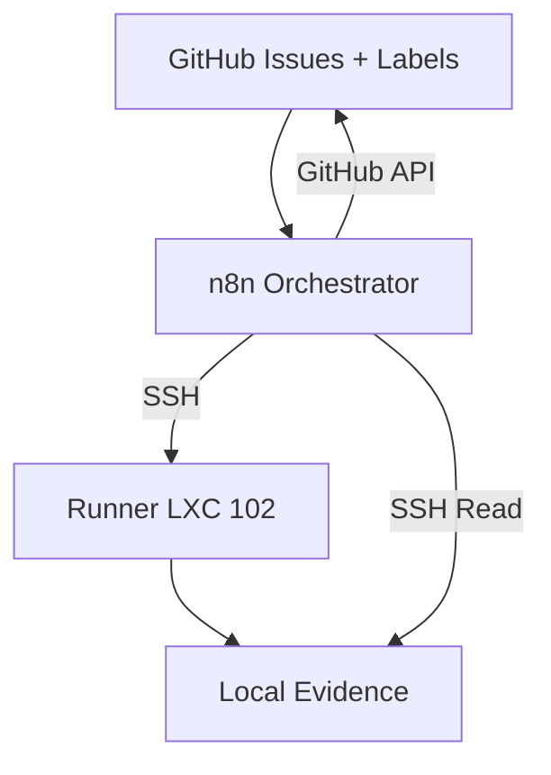

# n8n Blueprint Workflow — Source of Truth

GitHub source of truth for the n8n Blueprint → SpecKit/OpenCode Bootstrap workflow.

## GitHub Source of Truth

- **GitHub Issue** = Auftrag / Source of Truth
- **GitHub Repo Files** = Regeln, Specs, Kontext
- **n8n** = Orchestrator / Router / Status-Synchronizer
- **Runner** (LXC 102) = Execution Boundary
- **OpenCode v1.17.9** = vorbereiteter Worker (Provider/Auth fehlt noch)
- **Issue Comments** = Evidence-Zusammenfassung

Agentenaufträge werden als GitHub Issues erstellt. n8n liest das Issue, startet den Runner, und kommentiert das Ergebnis zurück ins Issue.

Siehe: `docs/github-source-of-truth.md`, `docs/github-issue-intake-runbook.md`

### System Overview



**Dispatcher workflow:** `workflows/github-ready-issue-dispatch.export.json` (15 nodes, actual n8n ID: `Sv12QTo56NoPUu2D`)
**Smoke test:** Issue #2 ✅ EXECUTED — `agent:ready` → `agent:running` → `agent:needs-review` + `evidence:attached` transition verified. All 15 nodes green.
**Trigger strategy:** Polling (Schedule + GitHub Search API) — internal network has no public URL for GitHub webhooks
**StorageState:** Valid — Playwright persistent session functional

## Repo Structure

```
.
├── README.md              ← This file
├── STATUS.md              ← Current operational status
├── CHANGELOG.md           ← Version history
├── SECURITY.md            ← Security rules and boundaries
├── .gitignore             ← Strict exclusions
├── .github/
│   └── ISSUE_TEMPLATE/
│       └── agent-task.yml              ← Agent Task Issue Template
├── workflows/             ← n8n workflow JSON exports
│   ├── README.md
│   ├── debug-minimal-form-ui.export.json       ← Working reference form
│   ├── blueprint-old-broken.export.json        ← Broken V1 (historical)
│   ├── blueprint-v2.clean.export.json          ← Reconstructed V2
│   ├── speckit-smoke-workflow.json             ← Smoke-test workflow
│   ├── github-issue-intake.export.json         ← GitHub Issue → Runner Intake
│   └── github-ready-issue-dispatch.export.json ← GitHub Ready Issue → Runner Agent Dispatch
├── scripts/               ← Runner shell scripts
│   ├── start_blueprint_bootstrap.sh
│   ├── start_github_issue_run.sh
│   ├── speckit_iteration.sh
│   ├── export_n8n_workflows.sh
│   ├── publish_check.sh
│   └── validate_repo.sh
├── docs/                  ← Documentation
│   ├── import-publish-guide.md
│   ├── ui-reconstruction-runbook.md
│   ├── troubleshooting.md
│   ├── architecture.md
│   ├── security-boundaries.md
│   ├── evidence-index.md
│   ├── github-source-of-truth.md              ← GitHub SoT architecture
│   ├── github-issue-intake-runbook.md         ← Intake operating runbook
│   ├── run-input-schema.md                    ← RUN_INPUT contract
│   └── architecture/
│       ├── github-source-of-truth-flow.md     ← Mermaid diagrams (dispatch flow, state machine)
│       ├── system-map.mmd                     ← Standalone system component map
│       └── evidence-flow.mmd                  ← Standalone evidence sequence diagram
├── templates/             ← Prompt templates
│   └── INITIALISIERUNG_PROMPT_BLUEPRINT.md
├── evidence-index/        ← Evidence trail
│   ├── latest.md
│   └── known-evidence-paths.md
└── tests/                 ← Validation scripts
    ├── validate-json.sh
    ├── validate-shell.sh
    └── smoke-checks.sh
```

## Infrastructure

- **n8n Instance:** `http://192.168.1.52:5678` (LXC container 101 on Proxmox 192.168.1.136)
- **Runner:** LXC container 102 on Proxmox 192.168.1.136, IP `192.168.1.53`
- **Form Path (V2):** `/form/blueprint-speckit-bootstrap-v2`
- **Form Path (debug):** `/form/debug-minimal-form-ui`
- **GitHub Repo:** `https://github.com/xxammaxx/n8n-blueprint-workflow`

## Quick Start

- **Form Submission:** Open `http://192.168.1.52:5678/form/ae9f52c1-...` in browser
- **Agent Task:** Create Issue via `.github/ISSUE_TEMPLATE/agent-task.yml`
- **Import Workflow:** See `docs/import-publish-guide.md`

## Status

See `STATUS.md` for current operational status.
