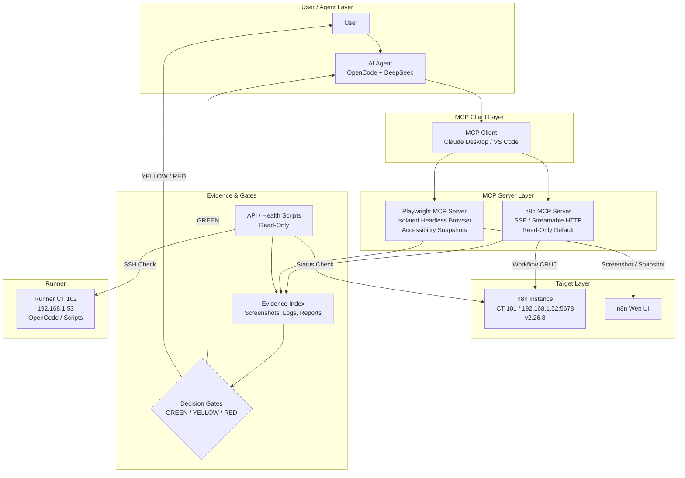

# MCP Build Process Architecture

## Version
1.0.0 — 2026-07-02

## Zielbild

Ein zuverlässiger Bauprozess für n8n Workflows mit getrennten Verantwortlichkeiten und sicheren Evidence-Gates. Das System nutzt zwei MCP-Server mit klar definierten Rollen:

- **n8n MCP Server** — Workflow-Read/Write/Validation
- **Playwright MCP Server** — UI-Verifikation und E2E-Smoke-Tests

## Architekturdiagramm



## Datenfluss

```
User → Agent → MCP Clients → n8n/Playwright → Evidence → Gates → Decision
```

1. **User** initiiert Aufgabe (Issue, Spec, Befehl)
2. **Agent** (OpenCode/DeepSeek) plant und delegiert
3. **MCP Clients** vermitteln zwischen Agent und MCP-Servern
4. **n8n MCP Server** liest/schreibt Workflows in n8n
5. **Playwright MCP Server** macht Screenshots/Accessibility-Snapshots der n8n UI
6. **API/Health Scripts** führen schnelle read-only Checks durch
7. **Evidence** sammelt alle Artefakte (Screenshots, Logs, Reports)
8. **Gates** entscheiden über Fortschritt (GREEN → weiter, YELLOW → Review, RED → Stopp)

## Rollen und Verantwortlichkeiten

### 1. n8n MCP Server
| Fähigkeit | Default | Nach Freigabe |
|-----------|---------|---------------|
| Workflow-Liste lesen | ✅ Erlaubt | — |
| Workflow-Details lesen | ✅ Erlaubt | — |
| Workflow-Struktur validieren | ✅ Erlaubt | — |
| Workflow-Status prüfen | ✅ Erlaubt | — |
| Workflow erstellen | ❌ Blockiert | ✅ Nach Freigabe |
| Workflow aktualisieren | ❌ Blockiert | ✅ Nach Freigabe |
| Workflow aktivieren | ❌ Blockiert | ❌ Immer blockiert (manuell) |
| Credentials lesen | ❌ Blockiert | ❌ Immer blockiert |
| Credentials erstellen/ändern | ❌ Blockiert | ❌ Immer blockiert |

### 2. Playwright MCP Server
| Fähigkeit | Default | Nach Freigabe |
|-----------|---------|---------------|
| Page snapshot (Accessibility Tree) | ✅ Erlaubt | — |
| Screenshot (ohne Secrets) | ✅ Erlaubt | — |
| Element-Präsenz prüfen | ✅ Erlaubt | — |
| Text-Inhalt prüfen | ✅ Erlaubt | — |
| Formular ausfüllen | ❌ Blockiert | ✅ Nur für Testdaten |
| Button klicken | ❌ Blockiert | ✅ Nur für Navigation |
| n8n Login ausführen | ❌ Blockiert | ✅ Nur mit Test-Credentials |
| Alte Session übernehmen | ❌ Blockiert | ❌ Immer blockiert |
| Screenshot mit Token speichern | ❌ Blockiert | ❌ Immer blockiert |

### 3. API / Health Scripts
| Check | Häufigkeit |
|-------|-----------|
| n8n API Health | Jeder Lauf |
| Runner SSH Health | Jeder Lauf |
| Dispatcher Health | Jeder Lauf |
| Provider Env Struktur | Jeder Lauf |
| Secret Hygiene | Jeder Lauf |

### 4. Runner (OpenCode/DeepSeek)
- Provider-Smoke-Test nur mit separater Freigabe
- Kostenbegrenzt (max 0.25 USD)
- Kein Agent-Issue-Lauf ohne Freigabe
- Keine Schreiboperationen auf n8n ohne Freigabe

### 5. Decision Gates

| Gate | Bedeutung | Aktion |
|------|-----------|--------|
| `GREEN_READONLY` | Alle read-only Checks bestanden | Weiter |
| `YELLOW_REVIEW` | Warnung oder Unsicherheit | Manuell prüfen |
| `RED_SECRET` | Secret-Leak erkannt | Sofort stoppen, nicht loggen |
| `RED_RUNTIME_RISK` | DB-Lock, Prozess-Hang | Nicht automatisch fortsetzen |
| `APPLY_AUTH_REQUIRED` | Schreiboperation nötig | Nutzer-Freigabe einholen |

## Secrets Policy

### Grundregeln
1. **Keine Secrets in Logs, Screenshots, oder Git**
2. **Keine Secrets in MCP-Tool-Antworten** — MCP-Server müssen Secrets filtern
3. **`.gitignore`** muss alle Secret-Dateien und lokale MCP-Konfigs blockieren
4. **Keine `.env`-Dateien** mit echten Werten versionieren — nur `.example` Templates

### Secret-Typen und Schutz

| Typ | Schutz | Ort |
|-----|--------|-----|
| n8n API Key | `secrets/n8n-api.env` (nicht versioniert) | Lokal |
| OpenCode API Key | `/opt/dev-fabric/secrets/opencode-provider.env` | Runner |
| n8n MCP Token | Nur im MCP-Client-Konfig (nicht versioniert) | Lokal |
| Playwright Sessions | `--isolated` (nur im RAM) | Niemals auf Disk |
| SSH Keys | `~/.ssh/` (Standard-Schutz) | Lokal |

## MCP Tool-Allowlist

### Erlaubte Tools (immer, read-only)

**n8n MCP:**
- `list_workflows` — Workflow-Liste abrufen
- `get_workflow` — Einzelnen Workflow lesen
- `get_workflow_status` — Status prüfen
- `search_nodes` — Node-Typen suchen

**Playwright MCP:**
- `browser_snapshot` — Accessibility-Tree abrufen
- `browser_take_screenshot` — Screenshot (ohne Secrets!)
- `browser_navigate` — Navigation (nur zu bekannten URLs)
- `browser_click` — Nur auf sicheren Elementen

### Erlaubte Tools (nur nach Freigabe)

**n8n MCP:**
- `create_workflow` — Workflow erstellen
- `update_workflow` — Workflow aktualisieren
- `deactivate_workflow` — Workflow deaktivieren

**Playwright MCP:**
- `browser_fill_form` — Formular ausfüllen (nur Testdaten)
- `browser_type` — Text eingeben (nur Testdaten)

### Blockierte Tools (niemals)

- `delete_workflow` — Workflow löschen
- `activate_workflow` — Workflow aktivieren
- `manage_credentials` — Credentials verwalten
- `execute_workflow` — Workflow ausführen
- `modify_settings` — n8n-Einstellungen ändern
- ALTE Playwright-Sessions verwenden
- Screenshots mit Token-Inhalten

## Playwright Session Policy

1. **Immer `--isolated`**: Browser-Profil nur im RAM, keine Disk-Persistenz
2. **Nie alte Sessions übernehmen**: Keine `.playwright-mcp/`-Ordner verwenden
3. **Headless für Automatisierung**: `--headless` für CI/CD und Agenten
4. **Keine Secrets in Screenshots**: Vor Screenshot sicherstellen, dass keine API-Keys, Tokens, oder Passwörter im Viewport sind
5. **Screenshots in `evidence/`**: Nur ins Evidence-Verzeichnis speichern

## n8n MCP Activation Policy

1. **Instance-Level MCP Server**: In n8n Settings aktivieren
2. **Authentifizierung**: MCP-Token generieren und sicher speichern
3. **Transport**: SSE oder Streamable HTTP (kein stdio für n8n MCP Server)
4. **Routing**: Bei Webhook/Queue-Setups: stabiles Routing auf genau eine MCP-fähige Instanz für `/mcp*`
5. **Token-Rotation**: MCP-Token regelmäßig rotieren

## E2E Test Strategy

### Phase 1: Read-Only Verification (immer)
1. Playwright: n8n Login-Seite Snapshot (kein Login)
2. n8n MCP: Workflow-Liste abrufen
3. API: Health-Check + Workflow-Count

### Phase 2: UI Smoke (nach Freigabe)
1. Playwright: Login mit Test-Credentials (nicht speichern)
2. Playwright: Workflow-Canvas Snapshot
3. Playwright: Node-Code visuell bestätigen
4. n8n MCP: Workflow-Struktur validieren

### Phase 3: Full E2E (nach Freigabe)
1. Workflow erstellen (n8n MCP)
2. UI-Verifikation (Playwright MCP)
3. Workflow validieren (n8n MCP)
4. Evidence sammeln

## Rollback / Backup Vorgaben

1. **Vor jeder Schreiboperation**: Workflow-Export als Backup
2. **Vor n8n MCP Write**: `get_workflow` → Backup speichern
3. **Kein automatischer Rollback**: Nur manuell nach Freigabe
4. **Backups in `evidence/`**: Mit Timestamp und Kontext

## Tool-Dump Vermeidung

- **Nicht alle n8n-MCP-Tools** in die MCP-Konfig aufnehmen
- **Nicht alle Playwright-MCP-Tools** aktivieren
- Nur die für den aktuellen Build-Prozess notwendigen Tools
- MCP-Konfiguration regelmäßig auf Minimalität prüfen

## Implementierungsstatus

| Komponente | Status |
|-----------|--------|
| Architektur-Dokument | ✅ Erstellt |
| n8n MCP Capability | ✅ Version 2.26.8 — unterstützt |
| Playwright MCP Capability | ✅ Installierbar, `--isolated` verfügbar |
| MCP Config Templates | ✅ Phase 14 |
| MCP Preflight Script | ⏳ Phase 15 |
| n8n MCP Aktivierung | ❌ Noch nicht aktiviert |
| Playwright E2E Test | ❌ Noch nicht ausgeführt |
| Secret Hygiene Gate | ⏳ Phase 19 |

## Änderungshistorie

| Datum | Version | Änderung |
|-------|---------|----------|
| 2026-07-02 | 1.0.0 | Initiale Architektur |
