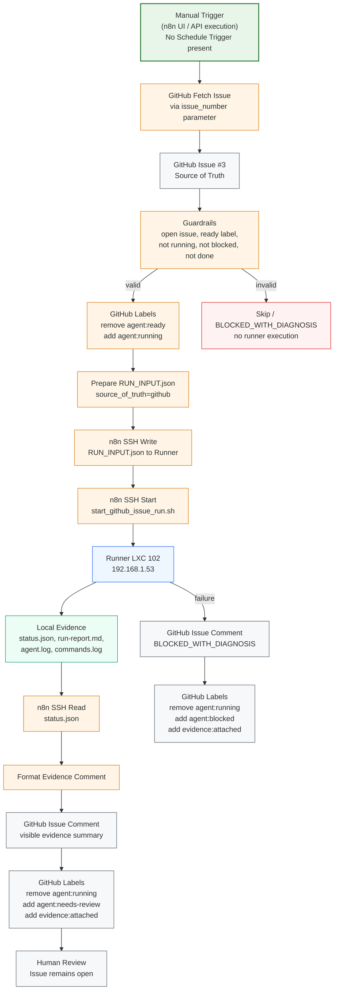
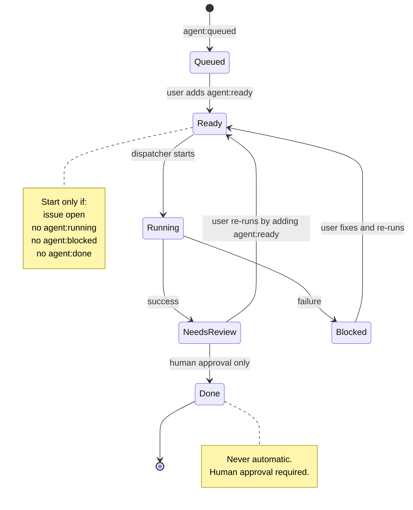

# GitHub Source of Truth — Agent Dispatch Flow

> **Evidence-based diagram.** Updated 2026-06-24 after dispatcher workflow build.
> All components shown exist in the validated system.

## Full Dispatch Flow (Mermaid)



## Label State Machine



## Trigger Decision

| Option | Status | Detail |
|--------|--------|--------|
| GitHub Trigger (issues:labeled) | ❌ NOT AVAILABLE | Requires public webhook URL — n8n instance (192.168.1.52) is on internal network, GitHub cannot deliver webhooks to private IP. |
| Polling (Schedule + Search API) | ❌ NOT IMPLEMENTED | Schedule Trigger node was not added to deployed workflow. Only Manual Trigger exists in current deployment. |
| Manual Trigger | ✅ ACTIVE | Dispatcher workflow `Sv12QTo56NoPUu2D` has only Manual Trigger. Execution #44 (Issue #3) succeeded for nodes 1-14, node 15 has pre-existing JS syntax error. |

## Component Map

```
┌──────────────────────────────────────────────────────────────┐
│                    GitHub (Source of Truth)                    │
│  ┌──────────────────┐  ┌────────────┐  ┌───────────────────┐ │
│  │   Issue Body     │  │  Labels    │  │   Comments        │ │
│  │  (Auftrag + AC)  │  │  (Status)  │  │   (Evidence)      │ │
│  └────────┬─────────┘  └─────┬──────┘  └───────────────────┘ │
│           │                  │                                 │
└───────────┼──────────────────┼─────────────────────────────────┘
            │                  │
            ▼                  ▼
┌──────────────────────────────────────────────────────────────┐
│         n8n Dispatcher (Orchestrator)                          │
│  ┌──────────────────┐  ┌──────────────────┐                   │
│  │ GitHub Trigger   │  │ Guardrails       │                   │
│  │ (issues:labeled) │  │ (anti-double-run)│                   │
│  └────────┬─────────┘  └────────┬─────────┘                   │
│           │                      │                             │
│           │   Mark Running       │                             │
│           │   (label update)     │                             │
│           └──────────┬───────────┘                             │
│                      ▼                                         │
│           ┌──────────────────────┐                             │
│           │ Prepare RUN_INPUT    │                             │
│           │ (from GitHub Issue)  │                             │
│           └──────────┬───────────┘                             │
│                      │ SSH                                     │
└──────────────────────┼────────────────────────────────────────┘
                       │
                       ▼
┌──────────────────────────────────────────────────────────────┐
│              Runner LXC 102 (Execution Boundary)                │
│  ┌──────────────────────┐  ┌──────────────────────────────┐   │
│  │ RUN_INPUT.json       │  │ start_github_issue_run.sh    │   │
│  └──────────┬───────────┘  └──────────────┬───────────────┘   │
│             │                             │                    │
│             ▼                             ▼                    │
│  ┌─────────────────────────────────────────────────────────┐  │
│  │              Runner Evidence                             │  │
│  │  status.json, run-report.md, commands.log, agent.log     │  │
│  └─────────────────────────────────────────────────────────┘  │
└──────────────────────────────────────────────────────────────┘
                       │
                       │ n8n SSH Read
                       ▼
┌──────────────────────────────────────────────────────────────┐
│         n8n (Evidence Handler)                                 │
│  Format Comment → GitHub Comment → Update Labels → Done       │
└──────────────────────────────────────────────────────────────┘
```

## Dual-Start Protection

The dispatcher enforces these rules before any runner execution:

1. Issue MUST be open
2. Label `agent:ready` MUST be present
3. Label `agent:running` MUST NOT be present
4. Label `agent:blocked` MUST NOT be present
5. Label `agent:done` MUST NOT be present
6. Repository MUST be `xxammaxx/n8n-blueprint-workflow`

If `agent:running` is already present: skip, optionally comment.

If `evidence:attached` is present and `agent:ready` is re-added: new run is allowed with a NEW run_id.

## Idempotency

Each run receives a unique Run ID:
```
gh-issue-<issue_number>-<YYYYMMDDTHHMMSSZ>
```

Evidence path:
```
/opt/dev-fabric/evidence/github-agent-runs/xxammaxx/n8n-blueprint-workflow/issue-<number>/<run_id>/
```

## Workflow References

| Name | ID | Role | Active | Trigger |
|------|----|------|--------|---------|
| GitHub Issue -> Runner Agent Intake | `jb7BgKeWGee5Iq9d` | Manual fallback (12 nodes) | No | Manual |
| GitHub Ready Issue -> Runner Agent Dispatch | `Sv12QTo56NoPUu2D` | Auto-dispatcher via Manual Trigger (15 nodes) | **Yes** — UI shows active | **Manual only** (no Schedule Trigger) |

## Issue #3 Processing Result

| Detail | Value |
|--------|-------|
| Issue | https://github.com/xxammaxx/n8n-blueprint-workflow/issues/3 |
| Execution | #44 — Manual trigger, 1m 28.494s |
| Nodes 1-14 | ✅ SUCCESS |
| Node 15 (Format Final Result) | ❌ ERROR — pre-existing JS syntax error |
| Pre-state | `agent:ready`, `mode:manual-terminal`, `risk:low` |
| Post-state | `agent:needs-review`, `evidence:attached`, `mode:manual-terminal`, `risk:low` |
| Runner Evidence | `/opt/dev-fabric/evidence/github-agent-runs/xxammaxx/n8n-blueprint-workflow/issue-3/gh-issue-3-20260626T073802Z/` |
| status.json | `GREEN_PARTIAL`, `source_of_truth=github`, `issue_number=3` |
