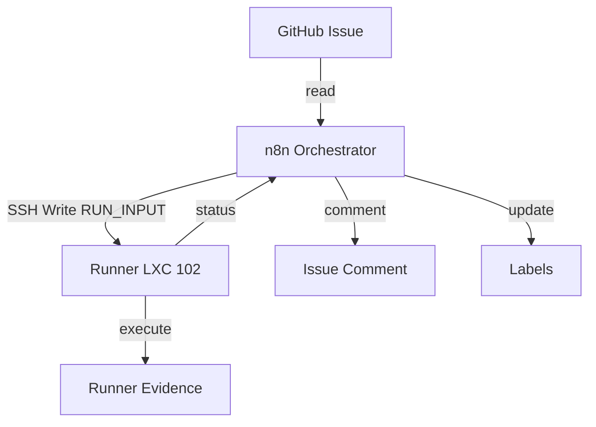

# GitHub Source of Truth — n8n/Runner Agent Orchestration

## Zielarchitektur

```
┌─────────────────────────────────────────────────────────┐
│                    GitHub (Source of Truth)              │
│  ┌──────────────┐  ┌──────────────┐  ┌───────────────┐  │
│  │   Issue      │  │  Repo Files  │  │    Labels     │  │
│  │  (Auftrag)   │  │  (Regeln)    │  │   (Status)    │  │
│  └──────┬───────┘  └──────────────┘  └───────────────┘  │
│         │                                                │
└─────────┼────────────────────────────────────────────────┘
          │
          │ read issue + labels
          ▼
┌─────────────────────────────────────────────────────────┐
│              n8n (Orchestrator / Router)                 │
│  ┌──────────┐  ┌──────────┐  ┌──────────────────────┐   │
│  │  GitHub  │  │ Validate │  │  Status-Synchronizer │   │
│  │  Polling │  │ Contract │  │  (Labels + Comments) │   │
│  │ (Search) │  │          │  │                      │   │
│  └────┬─────┘  └────┬─────┘  └──────────┬───────────┘   │
│       │              │                   │               │
│       │    Prepare RUN_INPUT.json        │               │
│       └──────────────┼───────────────────┘               │
│                      │                                   │
└──────────────────────┼───────────────────────────────────┘
                       │ SSH Write / Read
                       ▼
┌─────────────────────────────────────────────────────────┐
│               Runner (Execution Boundary)                │
│  ┌──────────────────┐  ┌────────────────────────────┐   │
│  │ RUN_INPUT.json   │  │ start_github_issue_run.sh  │   │
│  └────────┬─────────┘  └────────────┬───────────────┘   │
│           │                         │                    │
│           ▼                         ▼                    │
│  ┌──────────────────────────────────────────────────┐   │
│  │              Runner Evidence                      │   │
│  │  status.json, run-report.md, commands.log,        │   │
│  │  agent.log, github-context.md                     │   │
│  └──────────────────────────────────────────────────┘   │
│                                                          │
│  ┌──────────────────────────────────────────────────┐   │
│  │        OpenCode v1.17.9 (vorbereiteter Worker)    │   │
│  │  Status: installiert, aber Provider/Auth fehlt    │   │
│  │  Mode: manual-terminal (Default)                  │   │
│  └──────────────────────────────────────────────────┘   │
└─────────────────────────────────────────────────────────┘
                       │
                       │ n8n reads evidence
                       ▼
┌─────────────────────────────────────────────────────────┐
│              GitHub Issue Comments                       │
│  (Evidence-Zusammenfassung — lesbar, keine langen Logs)  │
└─────────────────────────────────────────────────────────┘
```

## Mermaid Diagram



## Trigger Strategy

| Option | Decision | Detail |
|--------|----------|--------|
| GitHub Trigger (issues:labeled) | ❌ NOT SELECTED | Requires public webhook URL — n8n instance is on internal network (192.168.1.52) |
| **Polling** (Schedule + GitHub Search API) | ✅ **SELECTED** | Uses n8n Schedule Trigger + GitHub Search API with `label:agent:ready` query. Compatible with internal network. |
| Manual Trigger | ✅ FALLBACK | Existing 12-node workflow `jb7BgKeWGee5Iq9d` retains Manual Trigger. 15-node dispatcher `k1c2d3FfWHee6Jr0e` also has Manual Trigger for smoke testing. |

**Why Polling was selected (but NOT yet implemented):**
1. n8n instance (CT 101 / 192.168.1.52) has no public URL — GitHub cannot deliver webhooks to private IP
2. Schedule Trigger would run periodically and query GitHub Search API: `is:issue is:open repo:xxammaxx/n8n-blueprint-workflow label:"agent:ready"`
3. No public internet exposure needed — all traffic is outbound from n8n to `api.github.com`
4. **However:** The Schedule Trigger node was never added to the deployed workflow. Only Manual Trigger exists in the current deployment.

**Dispatcher workflow:** `workflows/github-ready-issue-dispatch.export.json` (Live ID: `Sv12QTo56NoPUu2D`, 15 nodes, Status: ✅ ACTIVE — Manual Trigger only. No Schedule Trigger present.)

### 🛠️ Code Fix Applied (2026-06-26)

**Problem:** The "Format Final Result" Code node had an unused variable that blocked Publish.

```javascript
// BEFORE (Publish blocked):
const data = $input.first().json;  // ← UNUSED — triggers lint error
const prepData = $('Prepare RUN_INPUT.json').first().json;

// AFTER (Publish enabled):
const prepData = $('Prepare RUN_INPUT.json').first().json;
```

**n8n Code Node Linter Rule:** Version 2.26.8 flags **unused variables** as blocking issues. This prevents the Publish button from being enabled in the UI. The linter treats this as a hard error, not a warning.

**Fix applied via:** `PATCH /rest/workflows/Sv12QTo56NoPUu2D` (n8n REST API)

### ✅ Activation Status (2026-06-26) — Updated

| Method | Result | Detail |
|--------|--------|--------|
| API PATCH (code fix) | ✅ SUCCESS | Unused variable removed, workflow updated |
| API POST /activate | ✅ SUCCESS | `POST /rest/workflows/Sv12QTo56NoPUu2D/activate` → `{"active":true}` HTTP 200 |
| UI Active Status | ✅ **CONFIRMED ACTIVE** | UI shows ▶️ icon, all nodes show "Deactivate" |
| Trigger Type | ⚠️ **Manual Trigger ONLY** | No Schedule Trigger node present in deployed workflow |
| Schedule Auto-Run | ❌ **NOT POSSIBLE** | Schedule Trigger node was never added to the workflow |
| Issue #3 Processing | ✅ **PROCESSED (14/15 OK)** | Execution #44, Manual trigger. Node 15 has pre-existing JS syntax error. Post-state: `agent:needs-review`, `evidence:attached`. |

### Key Correction: No Schedule Trigger in Deployed Workflow

The deployed dispatcher workflow (`Sv12QTo56NoPUu2D`) contains **only a Manual Trigger**. The Schedule Trigger, GitHub Search, and Pick First nodes were NOT included in the workflow export. This means:

- **Workflow is active** and can be executed manually
- **No automatic polling** occurs — no Schedule Trigger to fire
- **Issue #3 was processed** successfully via Manual Trigger (Execution #44)
- For Schedule auto-run: nodes must be added via n8n UI, then UI-Publish + UI-Active-Toggle

### Schedule Trigger Activation (when configured)

In n8n v2.26.8, Schedule Trigger registration at startup requires the workflow to be **activated through the UI** (Publish + Active Toggle):

```
UI Publish + Active Toggle (with Schedule node) → active=1 + Schedule registered at startup ✅
API PATCH + POST /activate (no Schedule node)   → active=1, Manual only                    ✅
CLI publish:workflow                            → active=1 in DB only, Schedule NOT registered ❌
DB UPDATE SET active=1                          → active=1 in DB only, Schedule NOT registered ❌
```

**Verification command (when Schedule Trigger is configured):**
```bash
pct exec 101 -- journalctl -u n8n --no-pager | grep "Currently active workflows" -A20
```
Sv12QTo56NoPUu2D must appear in this list for the Schedule Trigger to fire.

## Source-of-Truth-Regeln

### Primäre Wahrheit (gewinnende Ebene)
1. **GitHub Issue Body + Labels** — der Auftrag
2. **GitHub Repo Files** — Regeln, Specs, Kontext
3. **GitHub Issue Comments** — Evidence-Zusammenfassung
4. **Runner Evidence** (lokal) — Rohbelege

### Sekundäre Quellen (advisory only, müssen validiert werden)
- n8n Form Input
- Chat-Verlauf
- Lokaler Memory
- Alte n8n-Zustände

### Konfliktregel
Wenn GitHub Issue und n8n Input widersprechen, **gewinnt GitHub**.
Chat-/n8n-Formdaten sind dann nicht Source of Truth.

## Labelmodell

| Label | Semantik |
|-------|----------|
| `agent:queued` | Auftrag existiert, aber noch nicht startbereit |
| `agent:ready` | **Startsignal** für n8n/Runner |
| `agent:running` | Lauf läuft |
| `agent:blocked` | Lauf blockiert |
| `agent:needs-review` | Human Review nötig |
| `agent:done` | Lauf abgeschlossen (nicht automatisch schließen) |
| `evidence:attached` | Evidence-Kommentar wurde geschrieben |
| `human-approval-required` | Nächster Schritt braucht Freigabe |
| `mode:manual-terminal` | Default-Modus (keine Agenten-Autonomie) |
| `mode:opencode-run` | OpenCode-Autonomie in tmux |
| `mode:hermes-review` | Hermes-Sidecar-Review (zukünftig) |
| `risk:low` | Niedriges Risiko |
| `risk:medium` | Mittleres Risiko |
| `risk:high` | Hohes Risiko |

### Label-Fluss
```
agent:queued → agent:ready → agent:running → agent:done
                                            → agent:blocked
                                            → agent:needs-review
                        evidence:attached (parallel zu agent:done)
```

## RUN_INPUT Contract

### GitHub Source-of-Truth Felder
```json
{
  "run_id": "gh-issue-123-20260623T120000Z",
  "source_of_truth": "github",
  "github": {
    "owner": "xxammaxx",
    "repo": "n8n-blueprint-workflow",
    "issue_number": 123,
    "issue_url": "https://github.com/xxammaxx/n8n-blueprint-workflow/issues/123",
    "trigger_label": "agent:ready"
  },
  "mode": "manual-terminal",
  "approval_policy": {
    "push": false,
    "pr": false,
    "merge": false,
    "github_actions": false,
    "provider_config": false
  },
  "runner": {
    "workspace_root": "/opt/dev-fabric/workspaces/projects",
    "evidence_root": "/opt/dev-fabric/evidence/github-agent-runs"
  },
  "agent_runtime": {
    "opencode_available": true,
    "opencode_version": "v1.17.9",
    "opencode_provider_configured": false,
    "hermes_available": false
  }
}
```

### Regeln
- Wenn `source_of_truth=github`, MUSS Runner `issue_url` und `issue_number` in Evidence schreiben.
- `mode=manual-terminal` bleibt Default.
- `mode=opencode-run` darf nur starten, wenn Provider/Auth explizit freigegeben und konfiguriert wurde.
- Alle `approval_policy`-Felder sind default `false`.

## Evidence Comment Contract

n8n schreibt nach Runner-Ergebnis diesen Kommentar ins GitHub Issue:

```markdown
## Agent Run Result

**Status:** GREEN_PARTIAL

**Run ID:** ...
**Mode:** manual-terminal
**Source of Truth:** GitHub Issue
**Runner:** lxc-dev-runner / 192.168.1.53

### Evidence

Local evidence path:

`/opt/dev-fabric/evidence/github-agent-runs/...`

### Verification

| Check                        | Result |
| ---------------------------- | ------ |
| RUN_INPUT validated          | PASS   |
| Runner started               | PASS   |
| Evidence written             | PASS   |
| OpenCode available           | PASS   |
| OpenCode provider configured | NO     |

### Changed files

No repository files changed by the agent run.

### Approval state

* Push: not approved
* PR: not approved
* Merge: not approved
* GitHub Actions: not approved
* Provider/API-Key configuration: not approved

### Next step

...

### Was kann das System jetzt im Vergleich zum vorherigen Lauf?

...
```

**Regel:** Keine langen Logs komplett ins Issue schreiben. Nur Zusammenfassung und lokale Evidence-Pfade.

## Nicht-Ziele

- Keine GitHub Actions (`.github/workflows/`)
- Keine CI/CD-Pipelines
- Keine automatischen Deployments
- Keine Provider/API-Key-Konfiguration ohne separate Approval
- Keine OpenCode-Autonomie ohne Provider
- Hermes wird in diesem Schritt NICHT installiert

## Sicherheitsgrenzen

- Keine direkten SQL-Updates
- Keine n8n DB-Manipulation
- Keine Credentials exportieren
- Keine Tokens/Secrets anzeigen
- Keine Private Keys anzeigen
- Keine Browserprofile kopieren
- Keine Cookies/Tokens/Auth-Header lesen
- Kein Force-Push
- Kein PR ohne Approval
- Kein Merge ohne Approval

## Approval-Regeln

| Aktion | Default | Benötigt |
|--------|---------|----------|
| GitHub Issue lesen | erlaubt | — |
| GitHub Labels lesen/setzen | erlaubt | — |
| RUN_INPUT.json schreiben | erlaubt | — |
| Runner Evidence schreiben | erlaubt | — |
| GitHub Issue kommentieren | erlaubt | — |
| **Push** | **verboten** | separate Freigabe |
| **PR erstellen** | **verboten** | separate Freigabe |
| **Merge** | **verboten** | separate Freigabe |
| **GitHub Actions** | **verboten** | separate Freigabe |
| **Provider/API-Key konfigurieren** | **verboten** | separate Freigabe |

## OpenCode-Status

- **Installiert:** Ja, v1.17.9 (Standalone-Binary)
- **Provider/Auth:** NICHT konfiguriert
- **`opencode run` ohne Provider:** Blockiert (hängt interaktiv)
- **`manual-terminal`:** Funktionsfähig (Default-Modus)
- **Autonome Agentenläufe:** Nicht möglich ohne Provider-Konfiguration

## Hermes-Status

- **Installiert:** Nein (deliberately excluded)
- **Plan:** Optionaler Sidecar für Review/Research (späterer Schritt)
- **Adapter-Platzhalter:** `agent-adapters/hermes_reviewer_adapter.sh.disabled`

## Dispatcher Workflow Reference

The **GitHub Ready Issue → Runner Agent Dispatch** workflow (ID: `Sv12QTo56NoPUu2D`, 15 nodes) is the dispatcher. See `docs/architecture/github-source-of-truth-flow.md` for full Mermaid diagrams:

- **Full Dispatch Flow** — end-to-end flowchart from `agent:ready` label to evidence comment (updated: Manual Trigger mode)
- **Label State Machine** — state diagram for label transitions
- **Trigger Decision** — polling vs webhook comparison (current: Manual Trigger only)
- **Component Map** — GitHub → n8n → Runner system architecture
- **Dual-Start Protection** — guardrails preventing concurrent agent runs
- **Issue #3 Result** — Processing details for the first successful manual dispatch run

## Evidence-Pfad-Struktur

```
/opt/dev-fabric/evidence/github-agent-runs/
└── <owner>/
    └── <repo>/
        └── issue-<number>/
            └── <run_id>/
                ├── RUN_INPUT.redacted.json
                ├── status.json
                ├── run-report.md
                ├── commands.log
                ├── agent.log
                └── github-context.md
```
